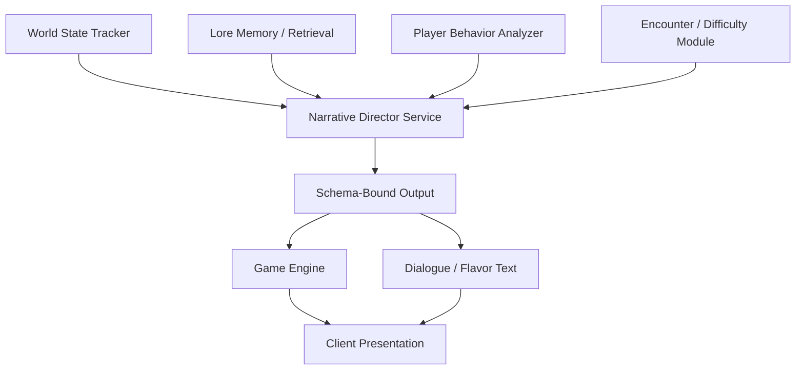
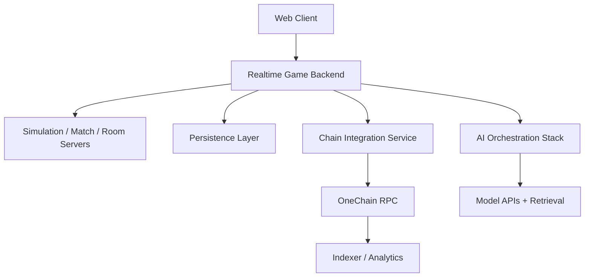

# NFT-DND

## Unified Game Design Document for OneChain

> A consolidated English-language design document that synthesizes the original gameplay vision, AI-driven RPG systems, and OneChain-specific blockchain architecture.

## Document Overview

| Field | Value |
| --- | --- |
| Project | `NFT-DND` |
| Target Chain | `OneChain` |
| Document Type | Unified Game Design Document (GDD) |
| Primary Purpose | Pre-production blueprint for gameplay, backend, AI, economy, blockchain, and live ops |
| Product Positioning | Real-time multiplayer AI-directed fantasy RPG with selective on-chain permanence |

**Document intent.** This version with a OneChain-first architecture while preserving the core concept: a real-time multiplayer AI-directed fantasy RPG where meaningful ownership, public history, and selective trust guarantees are anchored on-chain.

---

## At a Glance

| Pillar | Core Idea | Design Implication |
| --- | --- | --- |
| Gameplay First | The RPG must work even for players who do not understand blockchain | Core combat, movement, loot, and story remain frictionless |
| Selective On-Chain Value | Chain usage appears only where it adds real value | Rare loot, provenance, badges, chronicle, governance, and market operations |
| Operational Scalability | Fast simulation stays off-chain | Combat, AI runtime, matchmaking, and world state remain server-authoritative |
| World Coherence | AI generation must feel authored, not random | Lore memory, templates, rarity budgets, encounter grammars, and validation layers |

---

## Table of Contents

1. [Product Vision and Design Principles](#1-product-vision-and-design-principles)
2. [World Setting, Tone, and Narrative Frame](#2-world-setting-tone-and-narrative-frame)
3. [Core Gameplay Loop and Session Structure](#3-core-gameplay-loop-and-session-structure)
4. [Player Progression, Attributes, Skills, and Builds](#4-player-progression-attributes-skills-and-builds)
5. [Combat Model, Encounters, Enemies, and Difficulty Adaptation](#5-combat-model-encounters-enemies-and-difficulty-adaptation)
6. [World Generation, AI Director, and Content Pipeline](#6-world-generation-ai-director-and-content-pipeline)
7. [Multiplayer, Party Systems, Social Play, and Live Ops](#7-multiplayer-party-systems-social-play-and-live-ops)
8. [Economy, Itemization, NFTs, and Ownership Architecture on OneChain](#8-economy-itemization-nfts-and-ownership-architecture-on-onechain)
9. [Chronicle, Governance, Privacy, and OneChain-Native Systems](#9-chronicle-governance-privacy-and-onechain-native-systems)
10. [Technical Architecture, Security, UI, QA, and Production Plan](#10-technical-architecture-security-ui-qa-and-production-plan)
11. [Appendices](#11-appendices)

---

## 1. Product Vision and Design Principles

NFT-DND is designed as a real-time cooperative action RPG with procedural dungeon generation, adaptive narrative control, and blockchain-backed ownership of meaningful player achievements and loot. The game should feel like a live tabletop dungeon master running a persistent online world: the party moves in real time, fights, explores, bargains, and votes, while an AI Director interprets world state, retrieves lore memory, and reframes the session so the story feels responsive rather than pre-scripted.

The core fantasy is not simply "play an RPG on a blockchain." The real promise is:

> Enter a living fantasy world where your actions are witnessed, remembered, and selectively immortalized.

### Design Principles

| Principle | Requirement | Why It Matters |
| --- | --- | --- |
| Gameplay Must Stand Alone | A new player should be able to enjoy the game without understanding wallets or gas | Prevents blockchain friction from overwhelming the core fantasy |
| On-Chain Only When Valuable | Chain systems should anchor ownership, memory, governance, and market value | Avoids pointless tokenization of low-value moment-to-moment state |
| Scalable Fast Loop | Combat, AI generation, movement, and matchmaking stay off-chain | Keeps the game responsive and production-realistic |
| Authored Coherence | AI is constrained by world rules, content templates, and balancing systems | Prevents contradiction, tonal drift, and broken progression |

### Product Success Metrics

| Category | Key Signals |
| --- | --- |
| Game Metrics | Session length, party completion rate, encounter abandonment rate, progression depth, dialogue interaction rate, retention |
| Platform Metrics | Wallet creation conversion, sponsored transaction success, NFT mint conversion, marketplace liquidity, chronicle read-through, governance participation |

The product fails if the chain layer adds friction without increasing emotional attachment. It also fails if the gameplay is fun but the blockchain layer adds no meaningful economic or historical differentiation.

---

## 2. World Setting, Tone, and Narrative Frame

NFT-DND takes place in a fractured dark-fantasy realm built around shifting frontiers, unstable ruins, cursed ecosystems, and competing factions that understand magic, memory, and ownership in radically different ways. The world is intentionally unstable: regions can expand, collapse, mutate, or become contested through seasonal updates, AI-driven world events, and player-driven collective outcomes.

### Tone Guide

| Element | Desired Tone |
| --- | --- |
| Fantasy Mood | Severe, mythical, tactile |
| Environmental Feel | Old, dangerous, historically layered |
| Urban Hubs | Debt, conspiracy, rumor, unstable alliances |
| Dungeon Spaces | Pressure, consequences, secrets, atmosphere |
| Writing Style | Concise, evocative, coherent, never comedic by accident |

### Narrative Delivery Channels

| Channel | Purpose | Notes |
| --- | --- | --- |
| Environment | Environmental storytelling, props, telegraphs, weather | Communicates stakes without exposition dumps |
| AI Dungeon Master | Dynamic narrative framing and event text | Appears in log and event overlays |
| NPC Dialogue | Roleplay, quest logic, persuasion, betrayal | Generated within structured rules |
| Items and Chronicle | Long-tail memory and provenance | Preserves meaningful player history |

### Narrative Structure of a Run

The AI Director may improvise around this dramatic spine, but it should not abandon it casually. If players break assumptions, the system should route them into a valid successor state that preserves stakes instead of punishing creativity.

### Faction and Memory Pillars

- Factions influence prices, routes, access, contracts, and social standing.
- Exceptional acts become part of collective memory through chronicle entries, item provenance, and seasonal summaries.
- Ordinary actions remain ephemeral; legendary actions become historical.

That distinction preserves the value of on-chain memory. If every trivial event is permanent, nothing feels mythic.

---

## 3. Core Gameplay Loop and Session Structure

The minute-to-minute loop combines movement, combat, loot evaluation, short exploration decisions, and intermittent narrative prompts. The pacing should alternate between fast action and deliberate choice, so that action creates context and narrative decisions reframe action.

### Session Flow

### Standard Run Structure

| Stage | Description |
| --- | --- |
| Party Formation | Players queue solo or pre-made and assemble a target activity |
| Build Confirmation | Skills, equipment, consumables, and gear tags are locked |
| Staging Threshold | AI Director frames the stakes before deployment |
| Map Progression | Players traverse a procedural room graph with grammar-driven pacing |
| Mid-Run Decisions | Branching choices introduce risk, ideology, and faction consequences |
| Resolution | Boss kill, extraction, negotiated retreat, or wipe |
| Post-Run Bridge | Gameplay summary connects to ownership, chronicle, and progression |

### Room / Node Archetypes

| Archetype | Gameplay Role |
| --- | --- |
| Combat Arena | Pure combat pressure |
| Traversal Challenge | Positioning and hazard management |
| Puzzle Chamber | Deliberate problem solving |
| Treasure Cache | Reward and temptation |
| Social Encounter | Dialogue, negotiation, betrayal |
| Hazard Corridor | Attrition and tension |
| Elite Ambush | Spike challenge |
| Rest Point | Relief and preparation |
| Boss Lead-In | Dramatic preparation and signaling |

### Core Session Promise

Players should feel that they:

1. Finished a memorable game session.
2. Generated a meaningful story.
3. Only then encountered blockchain as an extension of that meaning.

---

## 4. Player Progression, Attributes, Skills, and Builds

NFT-DND uses a classless but strongly shaped progression model. Players do not choose one immutable class; instead they grow through attributes, gear tags, passives, active skills, faction standing, and group synergies.

### Core Attributes

| Attribute | Primary Function | Secondary Gameplay Meaning |
| --- | --- | --- |
| Strength | Melee damage, carry capacity, heavy interactions | Physical resistance and brute-force options |
| Agility | Movement speed, dodge timing, ranged precision | Action responsiveness and crit weighting |
| Intelligence | Magic scaling, mana efficiency, puzzle support | Ritual and arcane interaction depth |
| Charisma | Negotiation, trader prices, social checks | Nonviolent route access and faction leverage |
| Luck | Rare-drop weighting, edge-case survival, hidden opportunities | Roll smoothing and secret event access |

### Progression Horizons

| Horizon | Reward Type | Design Goal |
| --- | --- | --- |
| Run-to-Run | XP, loot, branch outcomes | Immediate retention and satisfaction |
| Seasonal | Unlocks, biome/faction arcs, challenge tracks | Medium-term aspiration |
| Collection | Provenance, badges, account identity, heritage assets | Long-term emotional attachment |

### Build Structure

| Layer | Implementation |
| --- | --- |
| Passive Web | Smaller and clearer than extreme ARPG skill trees, but still theorycraftable |
| Active Loadout | A compact four-slot primary action bar plus context actions |
| Gear Tags | Used by the backend to infer role coverage and synergy |
| Keystone Nodes | Transform mechanics or risk-reward models |

### Group Synergy Examples

- Wet + Shock amplifies chain lightning.
- Pin + Channel creates safe damage windows.
- Curse + Threshold converts healing into burst damage.
- Barrier + Dodge timing creates team-wide survival spikes.

The AI Director should occasionally recognize these synergies in narration so players feel seen by the system.

---

## 5. Combat Model, Encounters, Enemies, and Difficulty Adaptation

Combat is real-time and server-authoritative. The client submits intents; the server resolves movement, range, collision, cooldowns, resources, and final hit results.

### Combat Architecture

| Layer | Responsibility |
| --- | --- |
| Client | Intent submission, local responsiveness, UI feedback |
| Authoritative Server | Position truth, cooldown validation, hit resolution, damage results |
| Combat Rules | Damage formulas, statuses, mitigation, scaling |
| AI Director | Narrative reframing, contextual escalation, fiction-aware modifiers |

### Combat Outcome Model

| System | Notes |
| --- | --- |
| Damage Formula | Base power + skill multiplier + scaling + statuses + mitigation |
| Defense | Armor, resistance, dodge, barrier, guard, i-frames |
| Crits / Misses | Driven by visible stats and interactions, not incoherent randomness |
| Resources | Mana, stamina, charge, fury, or hybrid build-specific models |

### Enemy Archetypes

| Archetype | Pressure Pattern |
| --- | --- |
| Swarm | Area control and attrition |
| Tank | Slow pressure, positional denial |
| Skirmisher | Mobility and target harassment |
| Caster | Area control and ranged punishment |
| Summoner | Multiplication of pressure |
| Support | Buffing, healing, enabling |
| Assassin | Burst and backline threat |
| Artillery | Telegraph-heavy zone denial |
| Boss | Multi-phase escalation and narrative climax |

### Adaptive Difficulty Boundaries

Adaptive difficulty must never feel like dishonest rubber-banding. It should operate inside believable envelopes.

| Inputs | Possible Outputs |
| --- | --- |
| Time-to-kill, incoming damage, revives used, role coverage, gear score, route efficiency | Reinforcement timing, hazard density, boss thresholds, reward quality, phase scripting |

Preferred adaptation strategy:

- Change the **shape of pressure**, not just enemy health bars.
- Use lore-backed escalation instead of naked stat inflation.
- Support both **local adaptation** during a run and **macro adaptation** across seasons or biome health.

---

## 6. World Generation, AI Director, and Content Pipeline

The AI layer acts as a dungeon master, narrative editor, and context interpreter, not as an unconstrained text generator. The system should be a pipeline of cooperating services.

### AI Runtime Overview

### Core Services

| Service | Responsibility |
| --- | --- |
| World State Tracker | Authoritative room state, NPC state, triggers, objectives |
| Narrative Director | Context windows, pacing, continuity, branch validity, style control |
| Lore Memory | Retrieval of prior events, item history, faction context, player identity |
| Player Behavior Analyzer | Summarizes build style, tactics, and social behavior |
| Loot and Lore Service | Item metadata, provenance text, flavor generation |
| Difficulty Module | Challenge envelope adjustments |

### Non-Negotiable Rule: Schema-Bound Outputs

Gameplay-relevant AI outputs must never be free-form only. They should be serialized into safe, typed structures such as:

- new modifiers
- event triggers
- dialogue options
- consequence flags
- follow-up objectives
- NPC state changes
- optional flavor text

### Content Governance Model

| Content Layer | Source |
| --- | --- |
| 70%+ of structure | Deterministic templates, validated pools, dungeon grammars, stat rules |
| Remaining expressive layer | LLM dialogue, item lore, short-form flavor, scene dressing |

The AI should embellish, not silently redesign game systems in flight.

### Anti-Dead-End Logic

If player behavior breaks expected assumptions, the Director should preserve dramatic flow through interventions such as:

- a cave-in opening a side route
- a scavenger arriving with a clue
- a rival revealing hidden path information
- an enemy courier dropping a missed progression item

These interventions must feel like consequences or opportunities, never developer pity.

---

## 7. Multiplayer, Party Systems, Social Play, and Live Ops

NFT-DND is multiplayer by design, even for solo players, because the world, chronicle, market, and faction landscape are communal.

### Session-Level Social Structure

| System | Role |
| --- | --- |
| Party | Core cooperative unit, ideally 1-5 players |
| Shared Objectives | Drives synchronized narrative and room progression |
| Choice Layer | Timed votes, persuasion, branch resolution |
| Social Spice | Rare sabotage, secret paths, asymmetric faction information |

### Networking Requirements

| Channel | Purpose |
| --- | --- |
| Movement | Low-latency positional updates |
| Combat | Authoritative combat results and telegraphs |
| AI Narrative | Story overlays, log entries, branching prompts |
| Voting | Timers, resolution windows, choice synchronization |
| Spawns / State Deltas | Entity state, room transitions, hazard activation |
| Chat | Player expression and coordination |

### Collective Decision Model

| Level | Expected Resolution |
| --- | --- |
| Party-Level Branch Choice | Usually server-side majority/plurality |
| Faction / Seasonal Governance | On-chain or publicly auditable voting where legitimacy matters |
| Secret / Sabotage Layer | Rare, opt-in, carefully bounded systems |

### Live Ops Role

Live ops should treat NFT-DND as a seasonal narrative platform, not a static game.

| Live Ops Need | Example |
| --- | --- |
| Reward Tuning | Drop budgets, inflation control, sink adjustment |
| Chronicle Promotion | Highlight culturally important world events |
| Narrative Steering | Push faction pressure or seasonal events |
| Moderation | Block unsafe generated text or abusive social patterns |
| Emergency Intervention | Override broken content or broken economy loops |

---

## 8. Economy, Itemization, NFTs, and Ownership Architecture on OneChain

The economy is layered so the blockchain does not carry the burden of every routine interaction.

### Economic Layers

| Layer | Purpose | Chain Role |
| --- | --- | --- |
| Base Utility Layer | Day-to-day currency, crafting inputs, consumables | Off-chain |
| Premium / Governance Layer | Paid minting, governance weight, high-value interactions | Mixed |
| High-Signal Ownership Layer | NFTs, badges, provenance objects, prestige assets | On-chain |

### Item Categories

| Category | Chain Strategy |
| --- | --- |
| Weapons | High-tier items can become NFTs |
| Defensive Gear | Similar to weapons, selective minting |
| Talismans / Trinkets | Strong candidates for lore-rich rare items |
| Materials | Usually off-chain only |
| Quest / Lore Items | Mostly non-tradeable and non-tokenized |

### Loot and Mint Eligibility

| Tier | Typical Treatment |
| --- | --- |
| Common / Uncommon | Routine gameplay drops, non-tokenized |
| Rare | AI-authored lore possible, selective mint eligibility |
| Epic | More bespoke perks, provenance emphasis |
| Legendary | Strong mint candidate, major narrative significance |

### NFT Data Model on OneChain

Recommended NFT object contents:

| Field | Purpose |
| --- | --- |
| Identifier | Unique on-chain identity |
| Owner | Ownership and transfer state |
| Season ID | Seasonal provenance |
| Rarity Tier | Discovery and economy signaling |
| Type Family | Gameplay context |
| Metadata URI | Rich off-chain presentation |
| Lore / Provenance Hash | Immutable authenticity anchor |

### Marketplace Architecture

| Pattern | Guidance |
| --- | --- |
| Shared Listing Objects | Good for category-level markets |
| Event Indexing | Best for discovery and searchable UI |
| Avoid One Global Hot Object | Prevent contention and scaling pain |
| Provenance as Value Multiplier | History should increase desirability, not just stats |

### Transferability Policy

| Asset Type | Expected Rule |
| --- | --- |
| Legendary Weapons / Cosmetics | Transferable NFTs |
| Prestige Collector Items | Usually transferable |
| Titles / Rank / Office / World-First Honors | Usually profile-bound or non-transferable |

### Inflation Controls

- Track issuance by family and rarity.
- Monitor circulation concentration and listing pressure.
- Reduce future weighting for oversupplied categories.
- Use seasonal relevance shifts to preserve history without permanently breaking balance.

---

## 9. Chronicle, Governance, Privacy, and OneChain-Native Systems

The blockchain layer should focus on three high-value systems:

1. **Chronicle**: durable public memory
2. **Governance**: transparent and auditable decision-making
3. **Ownership**: portable and inspectable asset control

### Chronicle Pattern

| Design Choice | Recommendation |
| --- | --- |
| Data Storage | Prefer event emission plus indexing |
| Presentation | Off-chain indexers and profile views |
| Trigger Threshold | Reserve permanence for meaningful acts only |

Examples of chronicle-worthy events:

- world-first clears
- faction-defining decisions
- tournament championships
- culturally resonant emergent stories
- iconic item creations

### Governance Levels

| Governance Layer | Best Implementation |
| --- | --- |
| Ordinary dungeon branch votes | Mostly off-chain |
| Major faction decisions | On-chain or publicly auditable |
| Seasonal world outcomes | On-chain recommended where legitimacy matters |

### Privacy Strategy

The earlier concept imagined more direct generic zero-knowledge verification. This document instead adopts a practical hybrid OneChain-compatible approach.

### Sponsored Transactions

Sponsored transactions are strategically valuable for:

| Use Case | Why Sponsor It |
| --- | --- |
| First-time profile creation | Removes onboarding friction |
| First badge claim | Helps new players feel immediate ownership |
| Major world vote | Keeps governance accessible |
| Select reward claims | Encourages participation without gas anxiety |

### Public Profile Layer

Public profile surfaces should display:

- minted artifacts
- chronicle participation
- collectible badges
- market history
- seasonal heritage

If the system stores objects on-chain but never presents their history compellingly, players will not feel their value.

---

## 10. Technical Architecture, Security, UI, QA, and Production Plan

### High-Level System Architecture

### Platform Components

| Layer | Responsibility |
| --- | --- |
| Browser Client | Rendering, UI, local responsiveness |
| Realtime Backend | Authoritative gameplay simulation |
| Redis / Transient State | Fast in-memory room and party state |
| Durable Database | Progression, telemetry, content definitions |
| AI Orchestration | Generation, memory retrieval, validation, pacing |
| Chain Integration Service | PTB creation, sponsored tx rules, indexing handoff |
| Indexer / Analytics | Chronicle feeds, profile views, market discovery, telemetry |

### Security Principles

| Area | Rule |
| --- | --- |
| Gameplay Security | Server resolves truth, not the client |
| Anti-Cheat | Intent validation, anomaly detection, rate limiting |
| Sponsored Tx | Strict allowlists and payload restrictions |
| Marketplace / Shared Objects | Watch contention and design for scale |
| Wallet UX | Use standard transaction serialization patterns |

### UI Principles

| Interface Area | Design Guidance |
| --- | --- |
| Center | Playable map and active scene |
| Side Log | AI narration, concise contextual storytelling |
| Bottom HUD | Health, resources, skills, statuses |
| Right / Modal Layers | Inventory, party, objectives, mini-map |
| Blockchain UI | Explain actions in plain language, never in protocol jargon |

### QA Tracks

| QA Discipline | Focus |
| --- | --- |
| Simulation QA | Combat, room generation, progression, scaling |
| AI QA | Tone, lore consistency, schema compliance, moderation |
| Chain QA | Minting, event indexing, sponsored tx, profile display, settlement |

### Production Phases

| Phase | Goal |
| --- | --- |
| Phase 1 | Vertical slice: one biome, one party run, one boss, one mint path, one chronicle type |
| Phase 2 | Broader content, stronger live ops tooling, more economy depth |
| Phase 3 | Full seasonal cadence, deeper social systems, richer market and governance loops |

### Staffing Requirements

| Discipline | Needed |
| --- | --- |
| Game Design | Yes |
| Combat Design | Yes |
| AI Systems Design | Yes |
| Backend Engineering | Yes |
| Frontend Engineering | Yes |
| Move Smart Contract Engineering | Yes |
| Indexer / Data Engineering | Yes |
| QA Automation | Yes |
| Live Ops Design | Yes |
| Narrative Design | Yes |
| Product Operations | Yes |

This is not a blockchain wrapper over a simple web game. It is a live service with an AI runtime and a public ownership layer.

---

## 11. Appendices

### Appendix A. OneChain System Mapping

| Gameplay System | Primary Chain Pattern | Implementation Guidance |
| --- | --- | --- |
| Rare Item Ownership | Move object NFT + off-chain metadata URI | Mint through PTB, emit `ItemMinted`, transfer to owner |
| World Chronicle | Event emission + indexer | Use events for authenticity, off-chain indexing for presentation |
| Party Vote | Off-chain by default; chain vote for major moments | Keep ordinary branch votes off-chain |
| Faction Badges | Profile-bound object / non-transferable rule | Best for rank, titles, and governance weight |
| Marketplace | Shared listing objects + event indexing | Avoid one global hot registry |
| Stealth Proof | Off-chain verification + on-chain attestation | Record success without exposing route details |
| First-Time Onboarding | Sponsored transactions | Remove gas friction from early progression |

### Appendix B. Suggested Initial Deliverables

| Deliverable | Purpose |
| --- | --- |
| One-biome vertical slice | Validate a single great session loop |
| AI Director pipeline | Prove schema-bound AI runtime and dead-end recovery |
| Server-authoritative combat | Validate fairness and telemetry |
| Wallet + sponsored first tx flow | Prove onboarding feasibility |
| Chronicle event emission | Prove public memory layer |
| Marketplace prototype | Validate narrow transferable asset loop |
| Seasonal operations dashboard | Enable reward tuning and chronicle curation |

### Appendix C. Source Basis

This unified document was synthesized from two uploaded source texts:

- the original NFT-DND technical and game design document
- the OneChain analytical report mapping blockchain capabilities to the project vision

The current version merges the gameplay vision of the first source with the chain-specific implementation direction of the second source, while rewriting the overall design into a single English-language pre-production document.

### Appendix D. Detailed Gameplay Mechanics Catalogue

The detailed mechanics catalogue should be expanded in later iterations into:

| Catalogue Area | Planned Detail |
| --- | --- |
| Skill Families | Tags, cooldown bands, synergy rules, status taxonomy |
| Enemy Data Sheets | Archetypes, telegraphs, phase patterns, counters |
| Biome Grammars | Generation logic, room pools, landmark rules |
| Reward Tables | Tier distribution, anti-inflation controls, season hooks |
| Governance Templates | Vote types, quorum patterns, reward effects |
| Chronicle Thresholds | Rules for public permanence |

---

## Final Product Statement

The final implementation target is a game where a player can honestly say:

> I entered a living dungeon with my friends, the world reacted to us, we found something that mattered, and when it was truly worthy, the world remembered it beyond the run.

Every technical and design decision in this document exists to make that sentence true.
